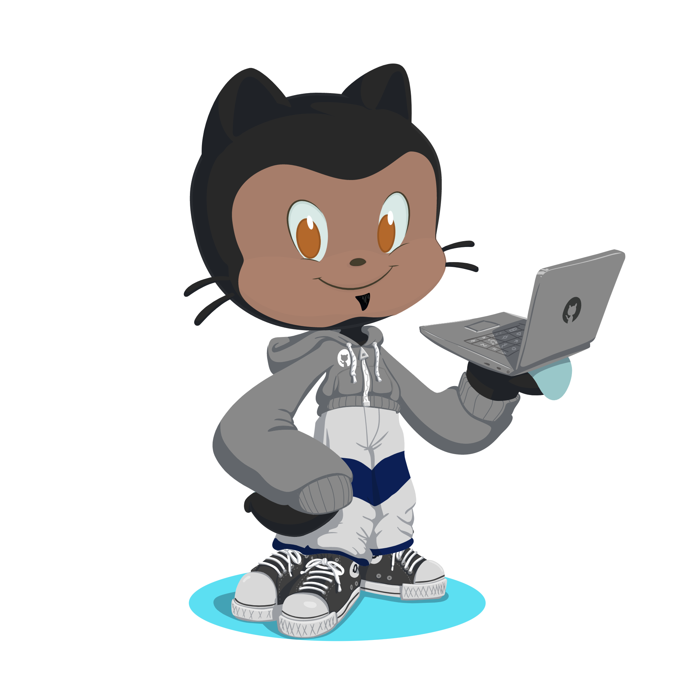

## 📑 About Me:

- 
 🌱 I'm currently learning: <strong>Java</strong>

- 
 🎯 my current goal: <strong>Full Stack Developer</strong>

- 
 📫 how to reach me: <strong>diegoguilherme752@gmail.com</strong>

- 
 💙 <strong>Love</strong> help people who are starting in the world of web development.

 

## 💻 Skills:

> ### Front End
>
>  

> ### Back End
>
> 

> ### Game
>
> 

## 🧰 Tools:

> 
 

## 🌐 Socials:

 
 

## 📊 GitHub Stats:

  
  <a href="https://githube.com/diegoguilhermeDS">
   
  

 

## 🏆 GitHub Trophies:

 

  

